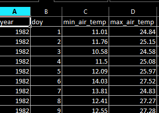
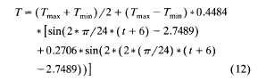

```{r setup, include=FALSE}
knitr::opts_chunk$set(echo = TRUE)
```

## Air temperature to water temperature

### Data Preparation

We will prepare the required input data first. The maximum and minimum air temperature is already downloaded from NASA in a csv file. We have two CSVs, one for Khulna and another for Srimangal -- **min_max_air_srimangal.csv** and **min_max_air_khulna.csv**. These files contain minimum and maximum air temperature from 1982 to 2019.

The following is a screenshot of the first few lines of the file **min_max_air_srimangal.csv**.



Now, make a vector of two districts, all 3-hourly time starting from 0 AM going to 21 PM and load the required packages.

```{r}
library(dplyr)
library(solrad)
longitude = c(91.678491, 89.441359)
latitude = c(24.303856, 22.800875)
areas = c("srimangal", "khulna")
longitude = c(91.678491, 89.441359)
latitude = c(24.303856, 22.800875)

# 3-hourly time starting from 0 to 21
time_of_the_day = seq(0, 21, 3)

pond_depth = 1.5204 # in meters
lambda_s = c(0,0,1,30.41,54.59,36.7,1,0)

each_layer_depth = pond_depth / 3
water_heat_capacity = 4.184
water_density = 997
```

```{r}
# Constants
sigma_const = 2.07 * (10 ** (-7)) # Stefan-Boltzman constant, unit KJ.m2/hr/K^4
k_sed = 2.53 # thermal conductivity coefficient for sediment
T_gw = 20 # temperature of the ground water, unit degree Celsius
```


We will start the simulation from year 2001 and continue it to year 2019.

Now, there are 6939 days from 2001 to 2019. We will run a loop for each of these days and we will need to figure out the corresponding year. The following code finds out 

```{r}
# days_2001_to_2019 = c(rep(c(rep(365,3),366),4), rep(365, 3))
days_2017_to_2019 = rep(365, 3)
(cumsum_days = cumsum(days_2017_to_2019))
all_years = seq(2017,2019,1)

month_no_leap_year = c(31, 28, 31, 30, 31, 30, 31, 30, 31, 31, 30, 31)
# length(month_no_leap_year)
# month_leap_year = c(rep(1, 31), seq(1, 29), seq(1, 31), seq(1,30), seq(1,31), seq(1,30), seq(1,31), seq(1,30),seq(1,31), seq(1, 31), seq(1,30), seq(1,31))
# length(month_leap_year)
# month_leap_year = c(31, 29, 31, 30, 31, 30, 31, 30, 31, 31, 30, 31)

(cumsum_month = cumsum(month_no_leap_year))


find_day_month_and_year = function(random_day){
  position = min(which(random_day<=cumsum_days)) # This is useful to find the year corresponding to a day starting from January 1, 2001
  all_years = seq(2017,2019,1)
  year_of_the_day = all_years[position]
  if(random_day <= 365){
    (day = random_day)
    month = min(which(day<=cumsum_month))
  } else{
    (day = random_day - cumsum_days[position - 1])
    month = min(which(day<=cumsum_month))
  }
  day_month_and_year = list(day=day, month=month, year = year_of_the_day)
  return(day_month_and_year)
}

```

### Find month

```{r}
month_no_leap_year = c(seq(1, 31), seq(1, 28), seq(1, 31), seq(1,30), seq(1,31), seq(1,30), seq(1,31), seq(1,30),seq(1,31), seq(1, 31), seq(1,30), seq(1,31))
# length(month_no_leap_year)
month_leap_year = c(seq(1, 31), seq(1, 29), seq(1, 31), seq(1,30), seq(1,31), seq(1,30), seq(1,31), seq(1,30),seq(1,31), seq(1, 31), seq(1,30), seq(1,31))
# length(month_leap_year)

```


```{r}
find_day_month_and_year(366)
```


```{r}
# random_day = 731
# position = min(which(random_day<=cumsum_days)) # This is useful to find the year corresponding to a day starting from January 1, 2001
#   all_years = seq(2001,2019,1)
#   (year_of_the_day = all_years[position])
#   if(random_day <= 365){
#     (day = random_day)
#   } else{
#     (day = random_day - cumsum_days[position - 1])
#   }
#   
#   day_and_year = list(day=day, year = year_of_the_day)
```


#### What is the year of the day and year for day 530 starting from the day January 1, 2017?

```{r}
# # Check the function with other values also
# day_year = find_day_and_year(530)
# (day = day_year$day)
# (year = day_year$year)
# 
# day_year = find_day_and_year(1)
# (day = day_year$day)
# (year = day_year$year)
```


Now, create a function that reads meteorological data according to different area, day and year.


```{r}
read_met_data_climatology = function(day, area, year_p){
  if(area == 1){
    district = "srimangal"
  }else{
    district = "khulna"
  }
  all_data = read.csv(paste0("min_max_air_", district, ".csv"))
  all_data = all_data[all_data$doy == day & all_data$year == year_p, ]
  return(all_data)
}
```

Now, we define a function that calculates diurnal temperature for a single day based on the equation 12 from Culberson and Piedrahita (1994). The following equation implies that the simulation starts at 6 AM. 



Now, write a function **calculate_diurnal_air_temperature_historical(i, area, year_p)** that calculates air temperature for a 24 hour duration from 6 AM for a day of the year **i**, area **area** and for a given year **year_p**. As we are considering three-hourly data and as the simulations starts from 6 AM, for any given day of a year for an area, it will calculate temperature for 6 AM, 9 AM, 12 PM, 3 PM, 6 PM, 9 PM, 12 AM and 3 AM 12 AM and 3 AM corresponds to the next day.

```{r}
calculate_diurnal_air_temperature_historical = function(i, area, year_p){
  # Read the air temperature data
  temp_historical = read_met_data_climatology(i, area, year_p)
  tmax_air = temp_historical$max_air_temp
  tmin_air = temp_historical$min_air_temp
  # 3 hourly time
  hours = seq(0,21,3)
  
  temp_at_different_times = sapply(hours, function(hour){((tmax_air + tmin_air)/2 + (tmax_air - tmin_air)*0.4484 *(sin(2*(pi/24)*(hour + 6) - 2.7489) + 0.2706 * sin(2 * (2 * (pi/24)* (hour + 6) - 2.7489)))) + 273.15})
  
  area = rep(areas[area], 8)
  year = rep(year_p, 8)
  
  if((i != 365 & i != 366) | (year_p %%4 == 0 & i == 365)){
    # If the day is not the last day of the year, the day of the year for temperature at 0 and 3 AM will be the immediate next day in the given year
    temp_for_a_single_day = data.frame(time = c(6,9,12,15,18,21,0,3), day = c(i,i,i,i,i,i,i+1,i+1), area = area, year = year_p, air_temp = temp_at_different_times)
  } else if((year_p%%4 != 0 & i == 365) | (year_p%%4 == 0 & i == 366)){
    #  If the day is the last day of the year, the day of the year for temperature at 0 and 3 AM will be for the first day of the next year
    temp_for_a_single_day = data.frame(time = c(6,9,12,15,18,21,0,3), day = c(i,i,i,i,i,i,1,1), area = area, year = c(rep(year_p, 6), year_p + 1, year_p + 1), air_temp = temp_at_different_times)
  } 
  
  return(temp_for_a_single_day)
}
```


Let's check if the function works or not.

```{r}
# Change the value of the arguments
calculate_diurnal_air_temperature_historical(1,1,1982)
```

As this function gives the minimum value at 6 AM and the maximum at 3 PM, it looks like the function is working.

Now, for Srimangal, from 1982 to 2019, calculate 3-hourly diurnal air temperature and save it as a separate csv file.

### No need to run the below, it was created for creating the dataset for diurnal air temperature. So, I have commented this. Uncomment this and if you want to create a new one.

```{r}
# diurnal_air_temp_sri = data.frame(time = numeric(0), day = numeric(0), area= character(), year=numeric(0), air_temp = numeric(0), stringsAsFactors=FALSE)
# 
# for(j in 1982:2019){
#   
#   # data_holder = data.frame(value = factor(), type = factor(), year = factor(), month = factor(), model = factor(), rcp = factor())
#   if(j%%4 == 0){
#     number_of_days = 366} else{
#       number_of_days = 365
#     }
#   out = vector("list", length(number_of_days))
#   for(i in 1:number_of_days){
#     out[[i]] = calculate_diurnal_air_temperature_historical(i,1,j)
#   }
#   vv1 = as.data.frame(do.call(rbind, out))
#   diurnal_air_temp_sri = rbind(diurnal_air_temp_sri, vv1)
# }
# 
# write.csv(diurnal_air_temp_sri, "diurnal_air_temp_sri.csv")
```

<!-- Similarly, for Khulna, calculate diurnal air temperature and save it as a separate csv file. -->

```{r}
# diurnal_air_temp_khu = data.frame(time = numeric(0), day = numeric(0), area= character(), year=numeric(0), air_temp = numeric(0), stringsAsFactors=FALSE)
# 
# for(j in 1982:2019){
#   
#   # data_holder = data.frame(value = factor(), type = factor(), year = factor(), month = factor(), model = factor(), rcp = factor())
#   if(j%%4 == 0){
#     number_of_days = 366} else{
#       number_of_days = 365
#     }
#   out = vector("list", length(number_of_days))
#   for(i in 1:number_of_days){
#     out[[i]] = calculate_diurnal_air_temperature_historical(i,2,j)
#   }
#   vv1 = as.data.frame(do.call(rbind, out))
#   diurnal_air_temp_khu = rbind(diurnal_air_temp_khu, vv1)
# }
# 
# write.csv(diurnal_air_temp_khu, "diurnal_air_temp_khu.csv")
```

<!-- Add two diurnal temperatures dataset for Srimangal and Khulna together and then save it. -->

```{r}
# diurnal_air_temp = rbind(diurnal_air_temp_sri, diurnal_air_temp_khu)
# write.csv(diurnal_air_temp, "diurnal_air_temp.csv")
```


#### Calculate long-term average of air temperature

To do this, we first need to convert **time**, **day** and **area** to factor for the calculation of long-term average.

```{r}
diurnal_air_temp = read.csv("diurnal_air_temp.csv")
```


```{r}
diurnal_air_temp$time = factor(diurnal_air_temp$time)
diurnal_air_temp$day = factor(diurnal_air_temp$day)
diurnal_air_temp$area = factor(diurnal_air_temp$area)
```


<!-- Now, using **dplyr** package, calculate the long-term average of air temperature by area, day and time. Finally, save this as csv file. -->

```{r}
# library(dplyr)
# long_term_average = diurnal_air_temp %>%
#   group_by(area, day, time) %>%
#   summarize(mean_temp = mean(air_temp))
# 
# long_term_average$area = as.character(long_term_average$area)
# long_term_average$day = as.numeric(long_term_average$day)
# long_term_average$hour = as.numeric(as.character(long_term_average$time))
# long_term_average$time = NULL
# 
# write.csv(long_term_average, "long_term_air_temp.csv")
```


We already have the pond temperature data recorded in Motiganj, Srimangal and Gutudia, Khulna. The dataset is formatted and saved with the name **Air_water_temp_dataset_Sylhet_Khulna_modified.csv**.


Now, we download data from NASA website. After we arrangge this data along with the pond temperature data. The data is named  **srimangal_modified.csv** and **khulna_modified.csv**. The first few lines of **srimangal_modified.csv** look like the following:


<!-- #### Note for Dareinis and Jim -->

<!-- I have used **ALLSKY_SFC_SW_DWN** or **All Sky Insolation Incident on a Horizontal Surface (MJ/m^2/day)** as **insolation**. I have considered this insolation as the total insolation for the day. So this will require some change or modifications. -->

<!-- #### Adding pond temperature data and NASA data to a single file in long format -->

<!-- Now, a long dataset is prepared that has values for any variable in a single column for these two areas instead of in two columns for two areas. -->

```{r}
# # Read the pond temperature data
# wide_data = read.csv("Air_water_temp_dataset_Sylhet_Khulna_modified.csv", stringsAsFactors = FALSE)
# wide_data$X = NULL # if there is any additional column named X is created, remove it
# 
# # date from 2018 to 2019 will be repeated for second area as we are making long data
# date = c(wide_data$date, wide_data$date)
# # Put the maximum temperature of Srimangal and Khulna in one column and save it as a new vector
# max_air_temp = c(wide_data$max_air_temp_syl, wide_data$max_air_temp_khu)
# # Similarly, put the minimum temperature of Srimangal and Khulna in one column and save it as a new vector
# min_air_temp = c(wide_data$min_air_temp_syl, wide_data$min_air_temp_khu)
# # Compute the average air temperature for any day for Srimangal by averaging over maximum and minimum air temperature 
# average_air_temp_syl = (wide_data$max_air_temp_syl + wide_data$min_air_temp_syl)/2
# # Make it a vector of size 730 with the same value
# long_term_air_average_syl = rep(mean(average_air_temp_syl), 730)
# # Compute the average air temperature for any day for Khulna by averaging over maximum and minimum air temperature 
# average_air_temp_khu = (wide_data$max_air_temp_khu + wide_data$min_air_temp_khu)/2
# # Make it a vector of size 730 with the same value
# long_term_air_average_khu = rep(mean(average_air_temp_khu), 730)
# # Add the two long term air average data for Srimangal and Khulna
# long_term_air_average = c(long_term_air_average_syl, long_term_air_average_khu)
# # Add the two morning water temperature data for Srimangal and Khulna
# morning_water_temp = c(wide_data$morning_water_temp_syl, wide_data$morning_water_temp_khu)
# # Add the two afternoon water temperature data for Srimangal and Khulna
# afternoon_water_temp = c(wide_data$afternoon_water_temp_syl, wide_data$afternoon_water_temp_khu)
# # Add the two rainfall data for Srimangal and Khulna
# rainfall = c(wide_data$rainfall_syl, wide_data$rainfall_khu)
```

<!-- Now, read the NASA data and add it with the pond temperature data. -->

```{r}
# srimangal_air = read.csv("srimangal_modified.csv")
# srimangal_air = srimangal_air[, c("YEAR", "DOY", "wind_speed_2m", "insolation_incident")]
# 
# srimangal_air = srimangal_air %>% filter(YEAR>=2018)
# 
# khulna_air = read.csv("khulna_modified.csv")
# khulna_air = khulna_air[, c("YEAR", "DOY", "wind_speed_2m", "insolation_incident")]
# 
# khulna_air = khulna_air %>% filter(YEAR>=2018)
# 
# year = c(srimangal_air$YEAR, khulna_air$YEAR)
# 
# doy = c(srimangal_air$DOY, khulna_air$DOY)
# 
# wind_speed_2m = c(srimangal_air$wind_speed_2m, khulna_air$wind_speed_2m)
# 
# insolation_speed = c(srimangal_air$insolation_incident, khulna_air$insolation_incident)
# 
# district = c(rep("Srimangal", 730), rep("Khulna", 730))
# 
# long_data = data.frame(date = date, year = year, doy = doy, district = district, max_air_temp = max_air_temp,
#                        min_air_temp = min_air_temp, long_term_air_average = long_term_air_average,
#                        morning_water_temp = morning_water_temp,
#                        afternoon_water_temp = afternoon_water_temp, rainfall = rainfall,
#                        wind_speed_2m = wind_speed_2m, insolation_speed = insolation_speed)
# 
# write.csv(long_data, "long_data.csv") # save it as a csv file
```

<!-- ### Creating data for simulation -- once again -->

```{r}
# srimangal_hist = read.csv("srimangal_historical.csv")
# khulna_hist = read.csv("khulna_historical.csv")
# srimangal_hist = srimangal_hist[srimangal_hist$YEAR >= 2001, ]
# khulna_hist = khulna_hist[khulna_hist$YEAR >= 2001, ]
# year_hist = srimangal_hist$YEAR
# day_hist = srimangal_hist$DOY
# insolance_sri = srimangal_hist$ALLSKY_SFC_SW_DWN
# insolance_khu = khulna_hist$ALLSKY_SFC_SW_DWN
# min_temp_sri = srimangal_hist$T2M_MIN
# max_temp_sri = srimangal_hist$T2M_MAX
# min_temp_khu = khulna_hist$T2M_MIN
# max_temp_khu = khulna_hist$T2M_MAX
# 
# data_for_simulation = data.frame(day = rep(day_hist, 2), year = rep(year_hist, 2), district = c(rep("srimangal", length(day_hist)), rep("khulna", length(day_hist))), insolation = c(insolance_sri, insolance_khu), wind_speed_2m =                                           runif(length(year_hist) * 2, min=67, max=90)/100, min_temp = c(min_temp_sri, min_temp_khu), max_temp = c(max_temp_sri, max_temp_khu))
# write.csv(data_for_simulation, "test_input_data_for_simulation.csv")
```

<!-- ### Initialize the first observation for simulation -->

```{r}
# data_air = read.csv("long_term_air_temp.csv")
# data_air = data_air[data_air$day == 1, ]
# data_air_sri = data_air[data_air$area == areas[1], ]
# data_air_sri = data_air_sri[data_air_sri$hour == 6, ]
# data_air_khu = data_air[data_air$area == areas[2], ]
# data_air_khu = data_air_khu[data_air_khu$hour == 6, ]
# initial_temp_sri = data_air_sri$mean_temp - 273.15
# initial_temp_khu = data_air_khu$mean_temp - 273.15
# 
# simulated_data = data.frame(layer = rep(c(1,2,3),2), time = rep(6, 6), day = rep(1, 6), year = rep(2017, 6), heat = rep(0, 6), temp = c(rep(initial_temp_sri, 3), rep(initial_temp_khu, 3)), area = c(rep(areas[1], 3), rep(areas[2], 3)))
# write.csv(simulated_data, paste0("simulated_data.csv"))
```


### Defining helper functions

### Convert dailly solar to 3-hourly

```{r}
# all_data = read.csv("test_input_data_for_simulation.csv")
# all_data = all_data[all_data$year>2016, ]
# month_no_leap_year = c(31, 28, 31, 30, 31, 30, 31, 30, 31, 31, 30, 31)
# (cumsum_month = cumsum(month_no_leap_year))
# all_data$month = rep(rep(c(rep(1, 31), rep(2, 28), rep(3, 31), rep(4,30), rep(5,31), rep(6,30), rep(7,31), rep(8,30),rep(9,31), rep(10, 31), rep(11,30), rep(12,31)),3), 2)
# 
# daily_to_three_hourly = read.csv("srad_daily_to_3-hourly.csv")
# 
# all_data$SRAD = all_data$insolation # Save the value of "insolation" in the "SRAD" column
# all_data$insolation = NULL # Remove this column
# 
# all_data = all_data %>% mutate(SRAD00 = case_when(
#   month == 1 ~ SRAD * daily_to_three_hourly$h0[1] * 1000,
#   month == 2 ~ SRAD * daily_to_three_hourly$h0[2] * 1000,
#   month == 3 ~ SRAD * daily_to_three_hourly$h0[3] * 1000,
#   month == 4 ~ SRAD * daily_to_three_hourly$h0[4] * 1000,
#   month == 5 ~ SRAD * daily_to_three_hourly$h0[5] * 1000,
#   month == 6 ~ SRAD * daily_to_three_hourly$h0[6] * 1000,
#   month == 7 ~ SRAD * daily_to_three_hourly$h0[7] * 1000,
#   month == 8 ~ SRAD * daily_to_three_hourly$h0[8] * 1000,
#   month == 9 ~ SRAD * daily_to_three_hourly$h0[9] * 1000,
#   month == 10 ~ SRAD * daily_to_three_hourly$h0[10] * 1000,
#   month == 11 ~ SRAD * daily_to_three_hourly$h0[11] * 1000,
#   month == 12 ~ SRAD * daily_to_three_hourly$h0[12] * 1000,
#   ))
# 
# all_data = all_data %>% mutate(SRAD03 = case_when(
#   month == 1 ~ SRAD * daily_to_three_hourly$h3[1] * 1000,
#   month == 2 ~ SRAD * daily_to_three_hourly$h3[2] * 1000,
#   month == 3 ~ SRAD * daily_to_three_hourly$h3[3] * 1000,
#   month == 4 ~ SRAD * daily_to_three_hourly$h3[4] * 1000,
#   month == 5 ~ SRAD * daily_to_three_hourly$h3[5] * 1000,
#   month == 6 ~ SRAD * daily_to_three_hourly$h3[6] * 1000,
#   month == 7 ~ SRAD * daily_to_three_hourly$h3[7] * 1000,
#   month == 8 ~ SRAD * daily_to_three_hourly$h3[8] * 1000,
#   month == 9 ~ SRAD * daily_to_three_hourly$h3[9] * 1000,
#   month == 10 ~ SRAD * daily_to_three_hourly$h3[10] * 1000,
#   month == 11 ~ SRAD * daily_to_three_hourly$h3[11] * 1000,
#   month == 12 ~ SRAD * daily_to_three_hourly$h3[12] * 1000,
#   ))
# 
# all_data = all_data %>% mutate(SRAD06 = case_when(
#   month == 1 ~ SRAD * daily_to_three_hourly$h6[1] * 1000,
#   month == 2 ~ SRAD * daily_to_three_hourly$h6[2] * 1000,
#   month == 3 ~ SRAD * daily_to_three_hourly$h6[3] * 1000,
#   month == 4 ~ SRAD * daily_to_three_hourly$h6[4] * 1000,
#   month == 5 ~ SRAD * daily_to_three_hourly$h6[5] * 1000,
#   month == 6 ~ SRAD * daily_to_three_hourly$h6[6] * 1000,
#   month == 7 ~ SRAD * daily_to_three_hourly$h6[7] * 1000,
#   month == 8 ~ SRAD * daily_to_three_hourly$h6[8] * 1000,
#   month == 9 ~ SRAD * daily_to_three_hourly$h6[9] * 1000,
#   month == 10 ~ SRAD * daily_to_three_hourly$h6[10] * 1000,
#   month == 11 ~ SRAD * daily_to_three_hourly$h6[11] * 1000,
#   month == 12 ~ SRAD * daily_to_three_hourly$h6[12] * 1000,
#   ))
# 
# 
# all_data = all_data %>% mutate(SRAD09 = case_when(
#   month == 1 ~ SRAD * daily_to_three_hourly$h9[1] * 1000,
#   month == 2 ~ SRAD * daily_to_three_hourly$h9[2] * 1000,
#   month == 3 ~ SRAD * daily_to_three_hourly$h9[3] * 1000,
#   month == 4 ~ SRAD * daily_to_three_hourly$h9[4] * 1000,
#   month == 5 ~ SRAD * daily_to_three_hourly$h9[5] * 1000,
#   month == 6 ~ SRAD * daily_to_three_hourly$h9[6] * 1000,
#   month == 7 ~ SRAD * daily_to_three_hourly$h9[7] * 1000,
#   month == 8 ~ SRAD * daily_to_three_hourly$h9[8] * 1000,
#   month == 9 ~ SRAD * daily_to_three_hourly$h9[9] * 1000,
#   month == 10 ~ SRAD * daily_to_three_hourly$h9[10] * 1000,
#   month == 11 ~ SRAD * daily_to_three_hourly$h9[11] * 1000,
#   month == 12 ~ SRAD * daily_to_three_hourly$h9[12] * 1000,
#   ))
# 
# all_data = all_data %>% mutate(SRAD12 = case_when(
#   month == 1 ~ SRAD * daily_to_three_hourly$h12[1] * 1000,
#   month == 2 ~ SRAD * daily_to_three_hourly$h12[2] * 1000,
#   month == 3 ~ SRAD * daily_to_three_hourly$h12[3] * 1000,
#   month == 4 ~ SRAD * daily_to_three_hourly$h12[4] * 1000,
#   month == 5 ~ SRAD * daily_to_three_hourly$h12[5] * 1000,
#   month == 6 ~ SRAD * daily_to_three_hourly$h12[6] * 1000,
#   month == 7 ~ SRAD * daily_to_three_hourly$h12[7] * 1000,
#   month == 8 ~ SRAD * daily_to_three_hourly$h12[8] * 1000,
#   month == 9 ~ SRAD * daily_to_three_hourly$h12[9] * 1000,
#   month == 10 ~ SRAD * daily_to_three_hourly$h12[10] * 1000,
#   month == 11 ~ SRAD * daily_to_three_hourly$h12[11] * 1000,
#   month == 12 ~ SRAD * daily_to_three_hourly$h12[12] * 1000,
#   ))
# 
# all_data = all_data %>% mutate(SRAD15 = case_when(
#   month == 1 ~ SRAD * daily_to_three_hourly$h15[1] * 1000,
#   month == 2 ~ SRAD * daily_to_three_hourly$h15[2] * 1000,
#   month == 3 ~ SRAD * daily_to_three_hourly$h15[3] * 1000,
#   month == 4 ~ SRAD * daily_to_three_hourly$h15[4] * 1000,
#   month == 5 ~ SRAD * daily_to_three_hourly$h15[5] * 1000,
#   month == 6 ~ SRAD * daily_to_three_hourly$h15[6] * 1000,
#   month == 7 ~ SRAD * daily_to_three_hourly$h15[7] * 1000,
#   month == 8 ~ SRAD * daily_to_three_hourly$h15[8] * 1000,
#   month == 9 ~ SRAD * daily_to_three_hourly$h15[9] * 1000,
#   month == 10 ~ SRAD * daily_to_three_hourly$h15[10] * 1000,
#   month == 11 ~ SRAD * daily_to_three_hourly$h15[11] * 1000,
#   month == 12 ~ SRAD * daily_to_three_hourly$h15[12] * 1000,
#   ))
# 
# all_data = all_data %>% mutate(SRAD18 = case_when(
#   month == 1 ~ SRAD * daily_to_three_hourly$h18[1] * 1000,
#   month == 2 ~ SRAD * daily_to_three_hourly$h18[2] * 1000,
#   month == 3 ~ SRAD * daily_to_three_hourly$h18[3] * 1000,
#   month == 4 ~ SRAD * daily_to_three_hourly$h18[4] * 1000,
#   month == 5 ~ SRAD * daily_to_three_hourly$h18[5] * 1000,
#   month == 6 ~ SRAD * daily_to_three_hourly$h18[6] * 1000,
#   month == 7 ~ SRAD * daily_to_three_hourly$h18[7] * 1000,
#   month == 8 ~ SRAD * daily_to_three_hourly$h18[8] * 1000,
#   month == 9 ~ SRAD * daily_to_three_hourly$h18[9] * 1000,
#   month == 10 ~ SRAD * daily_to_three_hourly$h18[10] * 1000,
#   month == 11 ~ SRAD * daily_to_three_hourly$h18[11] * 1000,
#   month == 12 ~ SRAD * daily_to_three_hourly$h18[12] * 1000,
#   ))
# 
# all_data = all_data %>% mutate(SRAD21 = case_when(
#   month == 1 ~ SRAD * daily_to_three_hourly$h21[1] * 1000,
#   month == 2 ~ SRAD * daily_to_three_hourly$h21[2] * 1000,
#   month == 3 ~ SRAD * daily_to_three_hourly$h21[3] * 1000,
#   month == 4 ~ SRAD * daily_to_three_hourly$h21[4] * 1000,
#   month == 5 ~ SRAD * daily_to_three_hourly$h21[5] * 1000,
#   month == 6 ~ SRAD * daily_to_three_hourly$h21[6] * 1000,
#   month == 7 ~ SRAD * daily_to_three_hourly$h21[7] * 1000,
#   month == 8 ~ SRAD * daily_to_three_hourly$h21[8] * 1000,
#   month == 9 ~ SRAD * daily_to_three_hourly$h21[9] * 1000,
#   month == 10 ~ SRAD * daily_to_three_hourly$h21[10] * 1000,
#   month == 11 ~ SRAD * daily_to_three_hourly$h21[11] * 1000,
#   month == 12 ~ SRAD * daily_to_three_hourly$h21[12] * 1000,
#   ))
# 
# write.csv(all_data, "input_data_for_simulation_2017_2019.csv")
# write.csv(all_data, "SRAD_2017_2019.csv")
```


Now, write a function that reads **test_input_data_for_simulation.csv** and reads the pond temperature and meteorological data.

```{r}
read_met_data = function(i, area_no){
  day_year = find_day_month_and_year(i)
  day = day_year$day
  year = day_year$year
  # all_data = read.csv("long_data.csv")
  all_data = read.csv("input_data_for_simulation_2017_2019.csv")
  # all_data = all_data[all_data$doy == day & all_data$year == year, ]
  all_data = all_data[all_data$day == day & all_data$year == year, ]
  all_data = all_data[all_data$district == areas[area_no], ]
  return(all_data)
}
```

Let's check whether this function is working or not.

```{r}
# Let's load data for day 1
daily_data = read_met_data(1, 1)
str(daily_data)
```

#### Calculate day length for a given day for a given place. This function returns sunrise, sunset and day length.

```{r}
get_day_length = function(place, day_arg){
  # Get the latitude for the place
  lat = latitude[place]
  
  # Compute the sunrise and sunset time using functions from solrad package
  # This will give us the day length which we can then use for computing
  # solar irradiance for 3 hours computing from solar irradiance for a day as
  # provided in the NASA LARC dataset
  
  # sunrise = Sunrise(day, lat)
  sunset = Sunset(day_arg, lat)
  
  # Compute the day length
  # Sunrise() gives back the time when the sun rises in AM
  # Sunset() gives the sunset time in PM.
  # So, to compute the day_length, we subtract sunrise from 12 and add the sunset time in PM
  # to get the day_length
  
  # day_length = (12 - sunrise) + sunset
  
  day_length = DayLength(day_arg, lat)
  
  sunrise = 12 + sunset - day_length
  
  # Make a list comprising of sunrise, sunset and day_length and return this
  
  solar_list = list("sunrise" = sunrise, "sunset" = sunset, "day_length" = day_length)
  return(solar_list)
}
```

Let's check the day length for the 1st place (Srimangal) on day 1.

```{r}
get_day_length(1, 1)
```


### Net heat flux measurement

#### Calculating phi_sn

Dareinis, please have a look at the calculation of this as I have used **All Sky Insolation Incident on a Horizontal Surface (MJ/m^2/day)** as the value of total measured incident radiation for the day. What I am doing below is dividing the all sky insolation by the day length to get the hourly insolation and then computing 3-hourly insolation for the given time period.

First, we need to calculate phi_s.

```{r}
# This function calculates phi_s or measured incident radiation
calculate_phi_s = function(i, time, place, day_arg){
  solar_data = get_day_length(place, day_arg)
  
  daily_data_f = read_met_data(i, place)
  # solar_daily = daily_data_f$insolation
  
  # Calculate hourly solar data
  #hourly_solar = solar_daily[place] / solar_data[["day_length"]]
  
  
  # sol_irradiance = str_pad
  
  # check if the time is before sunrise or if the time is after sunset
  # if(((time_of_the_day[time] + 3) < solar_data[["sunrise"]]) | ((time_of_the_day[time]) > solar_data[["sunset"]] + 12)){
  #   # if the 3-hour time is before sunrise or after sunset, solar irradiance is 0
  #   sol_irradiance = 0
  # } else if((time_of_the_day[time] < solar_data[["sunrise"]]) & ((time_of_the_day[time] + 3) > solar_data[["sunrise"]])){ 
  #   # check if the time starts before sunrise and there are some time in the 3-hourly periods that fall before sunrise or in the morning
  #     
  #     # Calculate the total duration of the 3-hours after the sunrise
  #     sunshine_duration = time_of_the_day[time] + 3 - solar_data[["sunrise"]]
  #     sol_irradiance = sunshine_duration * hourly_solar
  #   } else if((time_of_the_day[time] > solar_data[["sunrise"]]) & (time_of_the_day[time] < solar_data[["sunset"]] + 12) & ((time_of_the_day[time] + 3) > solar_data[["sunset"]] + 12)){
  #     # check if the time starts before sunset and there are some time in the 3-hourly periods that fall after sunset or in the evening
  #     
  #     # Calculate the total duration of the 3-hours before the sunset
  #     sunshine_duration = 12 + solar_data[["sunset"]] - time_of_the_day[time] 
  #     # e.g., if sunset is at 7 PM, 12 + solar_data[["sunset"]] gives us 19 
  #     # if the time of the day is 18 or 6 PM, the above equation stands as 12 + 7 - 6 = 1
  #     # Thus, it gives 1 hour of sunshine
  #     sol_irradiance = sunshine_duration * hourly_solar
  #   } else if(((time_of_the_day[time]) >= solar_data[["sunrise"]]) & ((time_of_the_day[time] + 3) <= solar_data[["sunset"]] + 12)){
  #     # Check if all the 3-hours are between sunshine and sunset
  #     
  #     sunshine_duration = 3
  #     sol_irradiance = sunshine_duration * hourly_solar
  #   }
  
  sol_irradiance = daily_data_f[, 8+time]
    
    # return solar irradiance
    return(sol_irradiance)
}
```

Let's check the value of this function for a particular day, day 2 at 3 PM for Srimangal.

```{r}
calculate_phi_s(1, 6, 1, 1)
```

```{r}
radiation_column_names = colnames(read_met_data(1, 1))[-c(1,2,3,4,5,6,7,8,9)]
```


### Now, write a function to calculate phi_sn.

```{r}

# This function calculates phi_sn or penetrating short-wave solar radiation

calculate_phi_sn = function(i, day_arg, three_hour, place){
  daily_data = read_met_data(i, place)
  solar_daily = daily_data$insolation
  wind_speed_2m = daily_data$wind_speed_2m
  
  # Calculate solar altitude angle lambda
  # lambda = abs(Altitude(day_arg, latitude[place], longitude[place], longitude[place], 0))
  lambda = lambda_s[three_hour]
  
  # Calculate R_s
  # R_s = 2.2 * (180 * lambda/pi)^(-0.97)
  R_s = 2.2 * (lambda)^(-0.97)
  if(R_s == Inf) R_s=0
  
  # W_z is wind velocity at 2 meters above the pond surface
  W_z = wind_speed_2m * 3.6
  
  # Calculate R, reflectivity adjusted for surface temperature
  R = R_s * (1 - 0.08 * W_z)
  
  # Calculate phi_s
  # phi_s = calculate_phi_s(i, three_hour, place, day_arg) # calculate_phi_s(i, time, place, day_arg)
  phi_s = daily_data[[radiation_column_names[three_hour]]]
  
  # Calculate phi_sn = phi_s * (1 - R)
  phi_sn = phi_s * (1 - R)
  
  # phi_sn for three hours
  # three_hours_phi_sn = phi_sn * 3
  three_hours_phi_sn = phi_sn
  
  # return the value of phi_sn
  return(three_hours_phi_sn)
}
```

Let's check the value of this function **phi_s()** for a particular day, day 1 at 3 PM for Srimangal.

```{r}
calculate_phi_sn(2, 2, 4, 2)
```


### Now, write a function to calculate phi_at

## Use tmax_air and tmin_air from the diurnal data of air temperature computed before

```{r}
calculate_phi_at = function(three_hour, place, cloud_fraction, day_arg, year_arg){
  # Get the time in hour
  hour = time_of_the_day[three_hour]
  
  # load the diurnal air temperature data
  air_temp = read.csv("diurnal_air_temp.csv")
  
  air_temp = air_temp[air_temp$time == hour, ]
  air_temp = air_temp[air_temp$day == day_arg, ]  
  air_temp = air_temp[air_temp$year == year_arg, ] 
  air_temp = air_temp[air_temp$area == areas[place], ] 
  t_ak = air_temp$air_temp # Already in Kelvin

  # t_ak = ((tmax_air + tmin_air)/2 + (tmax_air - tmin_air)*0.4484 *(sin(2*(pi/24)*(hour + 6) - 2.7489) + 0.2706 * sin(2 * (2 * (pi/24)* (hour + 6) - 2.7489)))) + 273.15
  e = (0.398 * (10 ** (-5)))*(t_ak ** (2.148))
  r = 0.03 # reflectance of the water surface to longwave radiation
  sigma = 2.07 * (10 ** (-7)) # Stefan-Boltzman constant, unit Kg/m2/hr/K^4
  phi_at = ((1 - r)* e * sigma * (t_ak ** (4))) * (1 + 0.17 * (cloud_fraction ** 2)) # this calculates phi_at for one hour
  
  # phi_at for three hours
  # three_hours_phi_at = phi_at * 3
  three_hours_phi_at = phi_at
  return(three_hours_phi_at)
}
```

Let's check the value of this function **phi_at()** for a particular day, day 1 at 3 PM for Srimangal.

```{r}
calculate_phi_at(6, 2, 0.3, 2, 2017)
```

### Calculate phi_ws

```{r}
calculate_phi_ws = function(T_wc, place, three_hour, layer_no, day_arg, year_arg){
  # T_wk is the water surface temperature in Kelvin
  
  # The following file heat_layers.csv contains the output of the simulation
  # heat_layers = read.csv("simulated_data.csv")
  # 
  # heat_layers = heat_layers[heat_layers$layer == layer_no, ]
  # heat_layers = heat_layers[heat_layers$area == areas[place], ]
  # if(three_hour!=1){
  #   heat_layers = heat_layers[heat_layers$time == time_of_the_day[three_hour-1], ] # Get the heat content computed for the last three-hour time period 
  # } else{
  #   heat_layers = heat_layers[heat_layers$time == time_of_the_day[8], ] # Get the heat content computed for the last three-hour time period 
  # }
  # print(paste0("Inside calculate_phi_ws(), the value of day is: ", day_arg))
  # heat_layers = heat_layers[heat_layers$day == day_arg, ]
  # heat_layers =  heat_layers[heat_layers$year == year_arg, ]
  T_wk = T_wc + 273.15
  # T_wk = heat_layers$temp
  # Calculate hourly phi_ws
  phi_ws = 0.97 * sigma_const * (T_wk^4)
  # Now, calculate three-hourly phi_ws
  three_hours_phi_ws = phi_ws # * 3
  
  # Return phi_ws for three hours or three_hours_phi_ws
  return(three_hours_phi_ws)
}
```

Let's check the value of this function **phi_ws()** for a particular day, day 1, 2001 at 9 AM for Srimangal.

```{r}
calculate_phi_ws(20, 2, 3, 1, 1, 2017)
```

### Calculate phi_e

```{r}
calculate_phi_e = function(i, place, three_hour, layer_no, day_arg, year_arg){
  
  # N, empirical coefficient from Lake Hefner, unit KJm-2km-1mmHg-1
    N = 5.0593
    
    daily_data = read_met_data(i, place)
  
    # solar_daily = daily_data$insolation
    wind_speed_2m = daily_data$wind_speed_2m
    
    # wind speed 2 m above the surface
    W2 = wind_speed_2m * 3.6
  
  # T_wc is water surface temperature in Celsius
  # The following file heat_layers.csv contains the output of the simulation
  # heat_layers = read.csv("simulated_data.csv")
  # 
  # heat_layers = heat_layers[heat_layers$layer == layer_no, ]
  # heat_layers = heat_layers[heat_layers$area == areas[place], ]
  # if(three_hour!=1){
  #   heat_layers = heat_layers[heat_layers$time == time_of_the_day[three_hour-1], ] # Get the heat content computed for the last three-hour time period 
  # } else{
  #   heat_layers = heat_layers[heat_layers$time == time_of_the_day[8], ] # Get the heat content computed for the last three-hour time period 
  # }
  # heat_layers = heat_layers[heat_layers$day == day_arg, ]
  # heat_layers =  heat_layers[heat_layers$year == year_arg, ]
  # T_wc = heat_layers$temp
  
  tmin_air_data = daily_data[daily_data$district == areas[place], ]
  tmin_air = tmin_air_data$min_temp
  
  # T_d is the average daily dew-point temperature
  # Using morning minimum temperature as the morning minimum dry-bulb temperature
  T_d = (tmin_air - 2) + 273.15 # from page 235 of the Culberson paper. Adding 273.15 to convert to Kelvin
  
  # e_s, saturated vapor pressure at T_wc; unit mmHg
  # e_s = 25.375 * exp(17.62 - (5271 / T_wc))
  
  # e_s calculated in different way
  hour = time_of_the_day[three_hour]
  air_temp = read.csv("diurnal_air_temp.csv")
  
  air_temp = air_temp[air_temp$time == hour, ]
  air_temp = air_temp[air_temp$day == day_arg, ]  
  air_temp = air_temp[air_temp$year == year_arg, ] 
  air_temp = air_temp[air_temp$area == areas[place], ] 
  t_ak = air_temp$air_temp # Already in Kelvin
  t_ac = t_ak - 273.15
  e_s = 0.622 * exp((17.27*t_ac)/(t_ac + 237.3))
  
  
  # e_a, water vapor pressure above the pond surface; unit mmHg
  # e_a = 610.78 * exp(17.2694 *((T_d - 273.16)/(T_d - 35.86)))
  
  # e_a calculated in different way
  rh = 0.8
  e_a = e_s * (1-rh)
  
  phi_e = N * W2 * (e_s - e_a)
  
  # three_hours_phi_e = 3 * phi_e
  three_hours_phi_e = phi_e
  
  # Return phi_e for three hours or three_hours_phi_e
  return(three_hours_phi_e)
}
```

```{r}
calculate_phi_e(1, 2, 3, 1, 1, 2017) # (i, place, three_hour, layer_no, day_arg, year_arg)
```


```{r}
# calculate_phi_c = function(i, place, three_hour, layer_no, day_arg, year_arg){
#   # wind speed 2 m above the surface
#   daily_data =read_met_data(i, place)
#   wind_speed_2m = daily_data$wind_speed_2m
#   # wind_speed_2m = daily_data$WS2M
#   W2 = wind_speed_2m * 3.6 # Convert ms-1 to Kmhr-1
#   
#   # T_wc is water surface temperature in Celsius
#   # heat_layers = read.csv("simulated_data.csv")
#   heat_layers = read.csv("simulation_output_Feb_2021.csv")
#   
#   heat_layers = heat_layers[heat_layers$layer == layer_no, ]
#   heat_layers = heat_layers[heat_layers$area == areas[place], ]
#   if(three_hour!=1){
#     heat_layers = heat_layers[heat_layers$time == time_of_the_day[three_hour-1], ] # Get the heat content computed for the last three-hour time period 
#   } else{
#     heat_layers = heat_layers[heat_layers$time == time_of_the_day[8], ] # Get the heat content computed for the last three-hour time period 
#   }
#   heat_layers = heat_layers[heat_layers$day == day_arg, ]
#   heat_layers =  heat_layers[heat_layers$year == year_arg, ]
#   T_wc = heat_layers$temp
#   
#   # Get the time in hour
#   hour = time_of_the_day[three_hour]
#   
#   
#   # load the diurnal air temperature data
#   air_temp = read.csv("diurnal_air_temp.csv")
#   air_temp = air_temp[air_temp$time == hour, ]
#   air_temp = air_temp[air_temp$day == day_arg, ]  
#   air_temp = air_temp[air_temp$year == year_arg, ] 
#   air_temp = air_temp[air_temp$area == areas[place], ] 
#   # Air temperature in degree Celsius
#   T_ac = air_temp$air_temp - 273.15
#   
#   # phi_c, sensible heat transfer
#   phi_c = 1.5701 * W2 * (T_wc - T_ac)
#   
#   three_hours_phi_c = phi_c * 3
#   
#   # Return phi_c for three hours or three_hours_phi_c
#   return(three_hours_phi_c)
# }
```

```{r}
calculate_phi_c = function(T_wc, i, place, three_hour, layer_no, day_arg, year_arg){
  # wind speed 2 m above the surface
  daily_data =read_met_data(i, place)
  wind_speed_2m = daily_data$wind_speed_2m
  # wind_speed_2m = daily_data$WS2M
  W2 = wind_speed_2m * 3.6 # Convert ms-1 to Kmhr-1
  
  # Get the time in hour
  hour = time_of_the_day[three_hour]
  
  
  # load the diurnal air temperature data
  air_temp = read.csv("diurnal_air_temp.csv")
  air_temp = air_temp[air_temp$time == hour, ]
  air_temp = air_temp[air_temp$day == day_arg, ]  
  air_temp = air_temp[air_temp$year == year_arg, ] 
  air_temp = air_temp[air_temp$area == areas[place], ] 
  # Air temperature in degree Celsius
  T_ac = air_temp$air_temp - 273.15
  
  # phi_c, sensible heat transfer
  phi_c = 1.5701 * W2 * (T_wc - T_ac)
  
  three_hours_phi_c = phi_c
  
  # Return phi_c for three hours or three_hours_phi_c
  return(three_hours_phi_c)
}
```


```{r}
calculate_phi_c(25, 1, 2, 4, 1, 1, 2017) # (T_wc, i, place, three_hour, layer_no, day_arg, year_arg)
```


```{r}
calculate_phi_sn_z = function(i, place, three_hour, sdd, layer_number, day_arg){
  solar_data = get_day_length(place, day_arg) # get_day_length(place, day_arg)
  phi_sn = calculate_phi_sn(i, day_arg, three_hour, place)
  
  # Calculate solar altitude angle lambda
  lambda = abs(Altitude(day_arg, latitude[place], longitude[place], longitude[place], 0))
  
  # Calculate R_s
  R_s = 2.2 * (180 * lambda/pi)^(-0.97)
  
  # W_z is wind velocity at 2 meters above the pond surface
  daily_data = read_met_data(i, place)
  wind_speed_2m = daily_data$wind_speed_2m
  W_z = wind_speed_2m
  
  # Calculate R, reflectivity adjusted for surface temperature
  R = R_s * (1 - 0.08 * W_z)
  
  # beta, fraction of solar irradiance absorbed at surface
  beta = 0.03
  
  # n_e, effective light extinction coefficient
  n_e = 1.7 /sdd # For now, assume sdd could be as much as the pond depth, 5 ft or 1.5204 m
  
  # Calculate z, the depth for a layer
  z = each_layer_depth + (layer_number - 1) * each_layer_depth
  
  # calculate phi_sn_z
  phi_sn_z = phi_sn * (1 - R) * (1 - beta) * exp(-1 * n_e * z)
  
  # calculate three-hourly phi_sn_z
  three_hours_phi_sn_z = 3 * phi_sn_z
  
  return(three_hours_phi_sn_z)
}
```

```{r}
calculate_phi_sn_z(2, 1, 4, 1.5, 1, 1)
```


```{r}
calculate_T_sed = function(place, three_hour, day_arg){
  
  # Get the value of the long-term average temperature
  all_data = read.csv("long_term_air_temp.csv")
  all_data = all_data[all_data$area == areas[place], ]
  all_data = all_data[all_data$day == day_arg, ]
  all_data = all_data[all_data$hour == time_of_the_day[three_hour], ]
  # long_term_avergae_air_temp = unique(all_data)
  long_term_avergae_air_temp = all_data$mean_temp - 273.15
  rm(all_data)
  
  # Set temperature of the sediment volume element to the long-term average temperature
  return(long_term_avergae_air_temp)
}
```

```{r}
calculate_T_sed(1, 4, 2)
```


```{r}
calculate_phi_sed = function(place, three_hour, day_arg, year_arg){
  # T_bot = bottom_layer_temp[i, time_of_the_day[three_hour]]
  layer_no = 3
  heat_layers = read.csv("simulated_data.csv")
  
  heat_layers = heat_layers[heat_layers$layer == layer_no, ]
  heat_layers = heat_layers[heat_layers$area == areas[place], ]
  if(three_hour!=1){
    heat_layers = heat_layers[heat_layers$time == time_of_the_day[three_hour-1], ] # Get the heat content computed for the last three-hour time period 
  } else{
    heat_layers = heat_layers[heat_layers$time == time_of_the_day[8], ] # Get the heat content computed for the last three-hour time period 
  }
  heat_layers = heat_layers[heat_layers$day == day_arg, ]
  heat_layers =  heat_layers[heat_layers$year == year_arg, ]
  T_bot = heat_layers$temp
  
  # Calculate T_sed
  T_sed = calculate_T_sed(place, three_hour, day_arg)
  
  # Calculate phi_sed 
  phi_sed = k_sed * ((T_bot - T_sed) / each_layer_depth) # Use layer depth as the value for delta_z or distance 
  # between the centers of the volume elements
  
  # Calculate and return three-hourly phi_sed
  three_hours_phi_sed = phi_sed * 3
  
  return(three_hours_phi_sed)
}
```

```{r}
calculate_phi_sed(1, 4, 1, 2017)
```


```{r}
# Calculalting phi_gw, heat loss from sediment volume element to ground water table

calculate_phi_gw = function(place, three_hour, day_arg){

  k_e = 2.5 # thermal conductivity coefficien for earth, unit kJmh-1r-1C-1
  T_gw = 20 # temperature of the ground water, unit degree Celsius
  
  delta_z = 0.2534 # distance between sediment and ground water volume elements, in meters
  
  # Calculate T_sed
  T_sed = calculate_T_sed(place, three_hour, day_arg)
  
  phi_gw = k_e * ((T_sed - T_gw)/delta_z)
  
  # Calculate and return three-hourly phi_gw
  three_hours_phi_gw = phi_gw * 3
  return(three_hours_phi_gw)
}
```

```{r}
calculate_phi_gw(1, 4, 1)
```


```{r}
calculate_phi_dz = function(place, three_hour, layer_no, day_arg, year_arg){
  # T_wc is water surface temperature in Celsius
  
  c_pw = 4.1816 # heat capacity of water, unit kJK-1kg-1
  A_v = 1 # idealized volume element surface area
  
  # Calculating T_wc or water temperature in 0 C
  heat_layers = read.csv("simulated_data.csv")
  
  heat_layers = heat_layers[heat_layers$layer == layer_no, ]
  heat_layers = heat_layers[heat_layers$area == areas[place], ]
  if(three_hour!=1){
    heat_layers = heat_layers[heat_layers$time == time_of_the_day[three_hour-1], ] # Get the heat content computed for the last three-hour time period 
  } else{
    heat_layers = heat_layers[heat_layers$time == time_of_the_day[8], ] # Get the heat content computed for the last three-hour time period 
  }
  
  heat_layers = heat_layers[heat_layers$day == day_arg, ]
  heat_layers =  heat_layers[heat_layers$year == year_arg, ]
  T_wc = heat_layers$temp
  
  # Calculating rho_w
  rho_w = (0.99987 + (0.69 * (10 ** (-5))) * T_wc) - ((8.89 * (10 ** (-6))) * (T_wc)**2) + ((7.4 * (10 ** (-8))) * (T_wc ** 3)) * 1000
  
  phi_dz = T_wc * rho_w * c_pw * A_v
  
  # Calculate and return three-hourly phi_dz
  three_hours_phi_dz = phi_dz * 3
  
  return(three_hours_phi_dz) 
}
```

```{r}
calculate_phi_dz(1, 4, 1, 1, 2017)
```


## Calculating heat flux for all three layers


### Return different values for layer 1

```{r}
calculate_and_return_heat_flux_layer_1 = function(i, place, three_hour, cloud_fraction, layer_no){
  day_year = find_day_month_and_year(i)
  day_f = day_year$day
  year_f = day_year$year
  
  
  
  ########################################################################################################################################################################
  ######################################          Volume 1  ---- Calculate phi_net or net heat flux for the pond            ##############################################
  ######################################           phi_net = phi_sn + phi_at - phi_ws - phi_e + phi_c + phi_dz              ##############################################
  ########################################################################################################################################################################
  
  phi_sn = calculate_phi_sn(i, day_f, three_hour, place)
  print("phi_sn done")
  print(phi_sn)
  phi_at = calculate_phi_at(three_hour, place, cloud_fraction, day_f, year_f)
  print("phi_at done")
  print(phi_at)
  
  phi_e =  calculate_phi_e(i, place, three_hour, 1, day_f, year_f)
  print("phi_e done")
  print(phi_e)
  
  hour = time_of_the_day[three_hour]
  
  
  if(i == 1 & day_f == 1 & three_hour == 3){
    # all_data = read.csv("long_term_air_temp.csv")
    all_data = read.csv("diurnal_air_temp.csv")
    all_data = all_data[all_data$area == areas[place], ]
    
    # all_data = all_data[all_data$day == day_f, ]
    all_data = all_data[all_data$year > 2016, ]
    
    T_w_t_1 = mean(all_data$air_temp) - 273.15
    # H_t_1 = (T_w_t_1 + 273.15) * each_layer_depth * water_heat_capacity * water_density
    H_t_1 = (T_w_t_1) * each_layer_depth * water_heat_capacity * water_density
  } else{
    if(three_hour == 1 & day_f == 1){
      data = read.csv("simulation_output_Feb_2021.csv")
      data = data[data$day == 365, ]
      data = data[data$time == 21, ]
      data = data[data$year == year_f - 1, ]
    } else if(three_hour == 1 & day_f > 1){
      data = read.csv("simulation_output_Feb_2021.csv")
      data = data[data$day == day_f - 1, ]
      data = data[data$time == 21, ]
      data = data[data$year == year_f, ]
    } else{
      data = read.csv("simulation_output_Feb_2021.csv")
      data = data[data$day == day_f, ]
      data = data[data$time == time_of_the_day[three_hour - 1], ]
      data = data[data$year == year_f, ]
    }
    
    T_w_t_1 = data$T_w_t
    H_t_1 = data$H_t
  }
  
  phi_ws = calculate_phi_ws(T_w_t_1, place, three_hour, 1, day_f, year_f)
  print("phi_ws done")
  print(phi_ws)
  phi_c = calculate_phi_c(T_w_t_1, i, place, three_hour, layer_no, day_f, year_f)
  print("phi_c done")
  print(phi_c)
  # phi_dz = calculate_phi_dz(place, three_hour, 1, day_f, year_f)
  # print("phi_dz done")
  # print(phi_dz)
  phi_net = phi_sn + phi_at - phi_ws - phi_e - phi_c
  H_t = H_t_1 + phi_net
  T_w_t = H_t / (each_layer_depth * water_heat_capacity * water_density)
  

  heat_components = list(time = hour, day = day_f, year = year_f, layer = layer_no, phi_sn = phi_sn, phi_at = phi_at, phi_ws = phi_ws, phi_e = phi_e, T_w_t_1 = T_w_t_1, H_t_1 = H_t_1, phi_c = phi_c, phi_net = phi_net, H_t = H_t, T_w_t = T_w_t)
  
  
  return(heat_components)
}
```


### Simulate pond temperature for a day

```{r}

simulate_pond_temperature_for_a_day = function(i, place, cloud_fraction, sdd){
  
  
  # Now, simulate net heat flux, heat and temperature for all three layers in a pond
  # Do it for three-hourly time periods startign with 6 AM assuming the minimum temperature occurs at 6 AM
  
 for(j in 1:8){
    # if(i==1 & (j== 1 | j==2 | j==3)){
    if(i==1 & (j== 1 | j==2)){ 
       print("I am skipping the loop")
      print("")
      next
    } 
    
    print("The value of i is: ")
    print(i)
    print("The value of j is: ")
    print(j)
    
    day_year = find_day_month_and_year(i)
    day_2 = day_year$day
    year_2 = day_year$year
    # 
    print(paste0("day is: ", day_2))
    print(paste0("year is: ", year_2))
    print(paste0("time period is: ", time_of_the_day[j]))
    
    net_heat_flux_layer_1 = calculate_and_return_heat_flux_layer_1(i, place, j, cloud_fraction, 1) # calculate_heat_flux_layer_1(i, place, three_hour, cloud_fraction)
    print(paste0("net_heat_flux_layer_1 is: "))
    print(net_heat_flux_layer_1)

    
    simulation_output_Feb_2021 = data.frame(time = net_heat_flux_layer_1$time, day=net_heat_flux_layer_1$day, year = net_heat_flux_layer_1$year, layer = net_heat_flux_layer_1$layer, phi_sn=net_heat_flux_layer_1$phi_sn, phi_at = net_heat_flux_layer_1$phi_at, phi_ws = net_heat_flux_layer_1$phi_ws, phi_e = net_heat_flux_layer_1$phi_e, 
                                T_w_t_1 = net_heat_flux_layer_1$T_w_t_1, H_t_1= net_heat_flux_layer_1$H_t_1, 
                                phi_c = net_heat_flux_layer_1$phi_c, phi_net = net_heat_flux_layer_1$phi_net,
                                H_t= net_heat_flux_layer_1$H_t, T_w_t = net_heat_flux_layer_1$T_w_t)
    # Add data to the CSV file simulated_data_area.csv

    write.table(simulation_output_Feb_2021, "simulation_output_Feb_2021.csv", sep = ",", col.names = !file.exists("simulation_output_Feb_2021.csv"), append = T)
    print(simulation_output_Feb_2021)
    print(paste0("One dataframe is created for the time period ", j))
    print("")
    print("")
  }
  
}
```

**Running the above code will add simulation output for a single day to simulated_data.csv file**

Running the below line will add new data to **simulation_output_Feb_2021.csv**. After running this, delete these new added lines from the file **simulation_output_Feb_2021.csv**.

####  Simulate pond temperature for day 1.

```{r}
# simulate_pond_temperature_for_a_day(1, 1, 0.3, 1.0)
```

#### Simulate pond temperature for day 2

```{r}
# simulate_pond_temperature_for_a_day(2, 1, 0.3, 1.0) # simulate_pond_temperature_for_a_day(i, place, cloud_fraction, sdd)
```


### Simulate temperature


```{r}
simulate_over_many_years = function(total_days){
  for(i in 1:total_days){
    simulate_pond_temperature_for_a_day(i, 1, 0.3, 1.0)
  }
}
```

Simulate temperature for layer 1 of the pond for first 30 days of 2017.

```{r}
simulate_over_many_years(30)
```

```{r}
# simulate_pond_temperature_for_a_day(2, 1, 0.3, 1.0)
```


